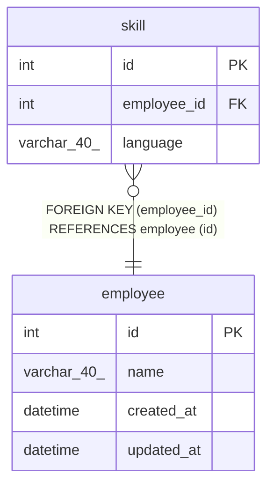

# sample

## Tables

| Name | Columns | Comment | Type |
| ---- | ------- | ------- | ---- |
| [employee](employee.md) | 4 | 従業員テーブル | BASE TABLE |
| [skill](skill.md) | 3 | スキル情報 | BASE TABLE |

## Relations

---

> Generated by [tbls](https://github.com/k1LoW/tbls)
