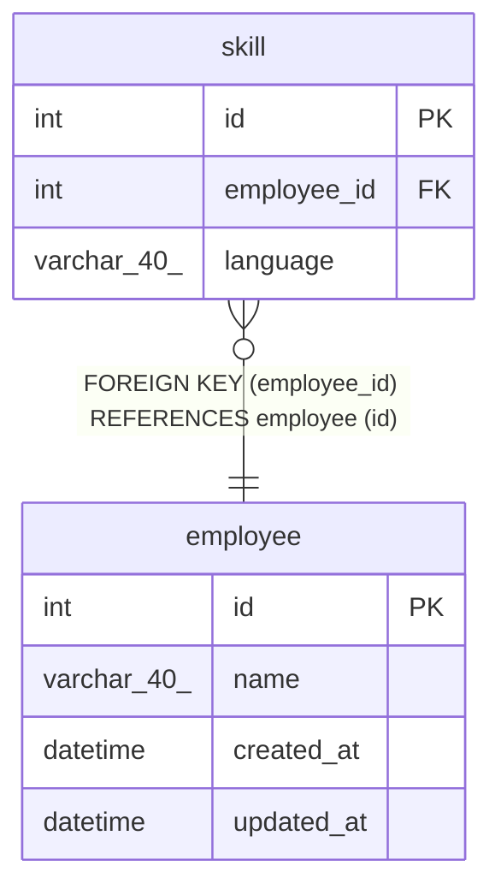

# skill

## Description

スキル情報

<details>
<summary><strong>Table Definition</strong></summary>

```sql
CREATE TABLE `skill` (
  `id` int NOT NULL AUTO_INCREMENT COMMENT 'スキルID',
  `employee_id` int NOT NULL COMMENT '従業員ID',
  `language` varchar(40) NOT NULL COMMENT 'プログラミング言語',
  PRIMARY KEY (`id`),
  KEY `employee_id` (`employee_id`),
  CONSTRAINT `skill_ibfk_1` FOREIGN KEY (`employee_id`) REFERENCES `employee` (`id`)
) ENGINE=InnoDB AUTO_INCREMENT=[Redacted by tbls] DEFAULT CHARSET=utf8mb4 COLLATE=utf8mb4_0900_ai_ci COMMENT='スキル情報'
```

</details>

## Columns

| Name | Type | Default | Nullable | Extra Definition | Children | Parents | Comment |
| ---- | ---- | ------- | -------- | ---------------- | -------- | ------- | ------- |
| id | int |  | false | auto_increment |  |  | スキルID |
| employee_id | int |  | false |  |  | [employee](employee.md) | 従業員ID |
| language | varchar(40) |  | false |  |  |  | プログラミング言語 |

## Constraints

| Name | Type | Definition |
| ---- | ---- | ---------- |
| PRIMARY | PRIMARY KEY | PRIMARY KEY (id) |
| skill_ibfk_1 | FOREIGN KEY | FOREIGN KEY (employee_id) REFERENCES employee (id) |

## Indexes

| Name | Definition |
| ---- | ---------- |
| employee_id | KEY employee_id (employee_id) USING BTREE |
| PRIMARY | PRIMARY KEY (id) USING BTREE |

## Relations



---

> Generated by [tbls](https://github.com/k1LoW/tbls)
